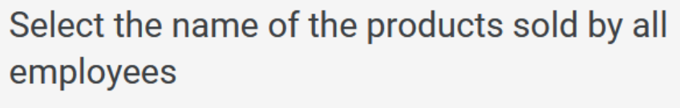
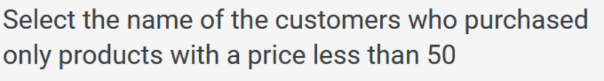
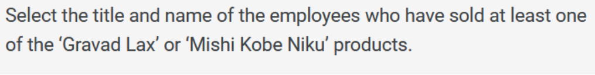
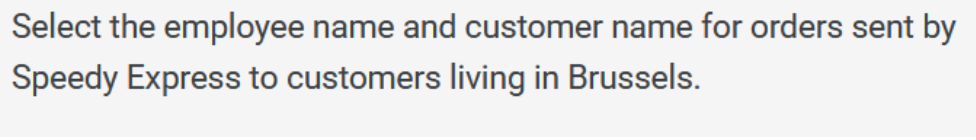
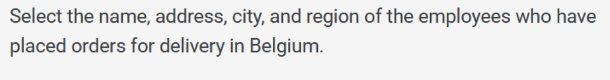

## 📦 Parcial 1 Big Data - 2025-02

### 1. 🆕 Pregunta 1

### 1. 🆕 Pregunta 2

### 1. 🆕 Pregunta 3

### 1. 🆕 Pregunta 4

### 1. 🆕 Pregunta 5


## 🧠 Entrega de Parcial

- Entrar a su git personal .
- Realizar el Fork del respositorio
- Realizar el git clone a su PC.
- Debe crear una rama local con su nombre_apellido, ej: Johanny_Valencia
- Realiza las 5 consultas a su base de datos de su eleccion.
- Colocar en respuesta.sql con las 5 respuestas
- Separar cada respuesta con Punto y coma (`;`) Archivo respuesta.sql

  ```sql  
    SELECT * FROM ...;
    SELECT * FROM ...;
    SELECT * FROM ...;
    SELECT * FROM ...;
    SELECT * FROM ...;
- `Es importante que creen la rama y el archivo respuesta.sql con esa estructura dada por el docente`
